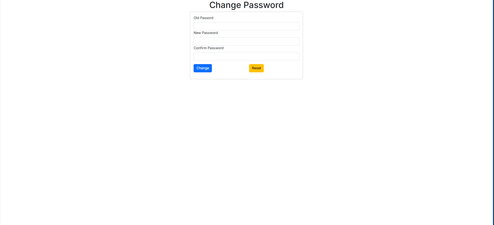
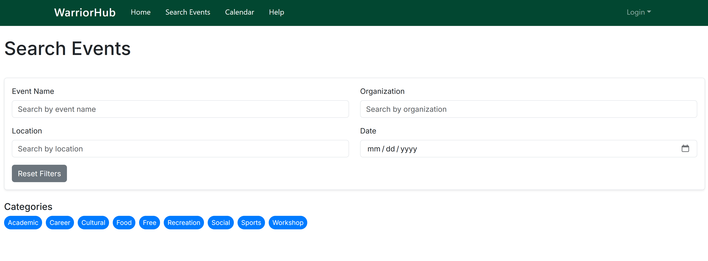
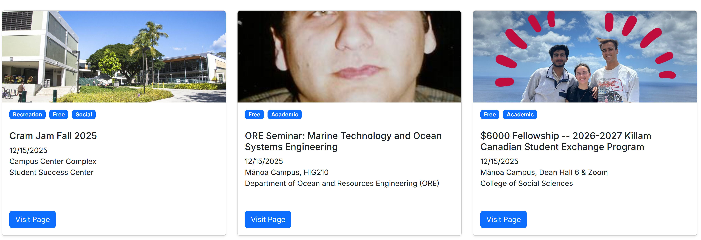
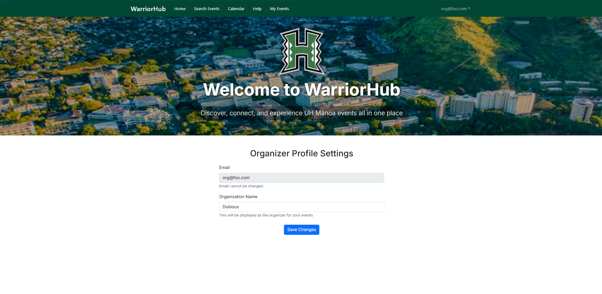
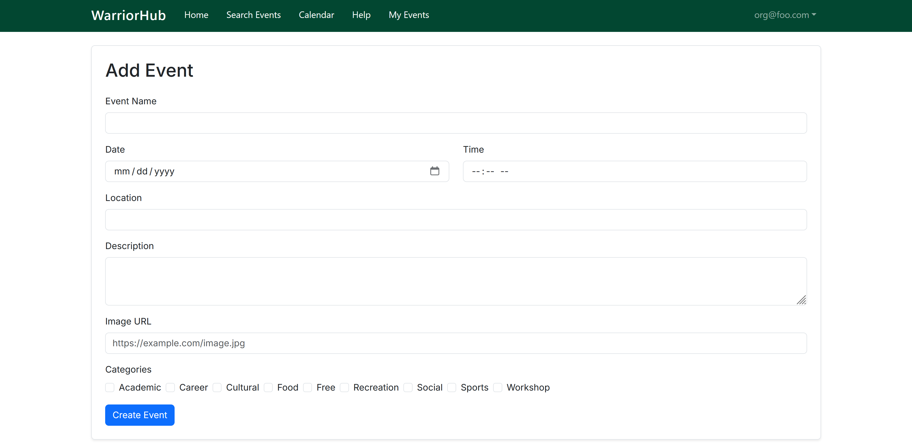
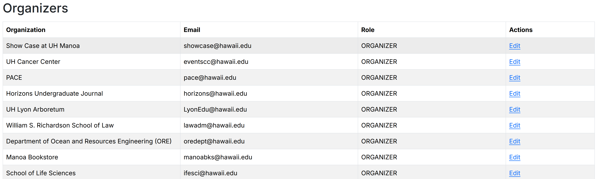
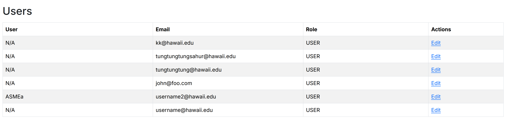
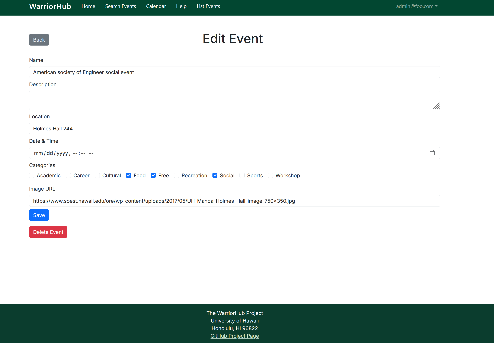

# WarriorHub: UH Mānoa Event Scheduler

[](https://github.com/warriorhub/warriorhub/actions/workflows/ci.yml)

## Table of contents

* [Overview](#overview)
* [Team](#team)
* [Our GitHub](#our-github)
* [Development](#development)
* [Deployment](#deployment)
* [User Guide](#user-guide)
* [Developer Guide](#developer-guide)
* [Community Feedback](#community-feedback)
* [Example Enhancements](#example-enhancements)

---

## Overview

WarriorHub is a centralized event discovery platform designed specifically for students at the University of Hawai‘i at Mānoa. The platform provides a single location to explore on-campus activities, eliminating the need to navigate multiple calendars or department websites. Users can view upcoming opportunities, learn about organizations, and stay connected with student life throughout the semester.

The web application will allow three types of roles: users, organizers, and admins. 

* Students can browse and archive events
* Organizers can create and manage events
* Admins will validate new events, manage event quality and accounts

### The Problem

UH Mānoa has multiple independent event calendars, leading to missed opportunities and overlooked events due to the absence of filtering options. This makes finding relevant events difficult, reducing participation and visibility.

### The Solution

We will implement a mass event scheduler. This will allow various organizations to input their events on a singular website, allowing for efficiency and ease of use.  

---

## Team

WarriorHub is designed, implemented, and maintained by:
* Sakura Takahashi (<sakuraet@hawaii.edu>)
  * Sakura is a senior studying Mathematics, she is the Project Manager for WarriorHub.
* Jiayi Liu (<liujiayi@hawaii.edu>)
  * Jiayi is a senior studying Mechanical Engineering, she is the Back-End Developer for WarriorHub.
* Kacy Kuniyoshi (<kacykuni@hawaii.edu>)
  * Kacy is a fourth-year studying Information and Computer Science, she is the Front-End Developer for WarriorHub.
* Jordan Wong (<jordanww@hawaii.edu>)
  * Jordan is a fourth-year studying Computer Science, he is the Systems Integrator for WarriorHub.
* Alicia Luck (<luckmana@hawaii.edu>)
  * Alicia is a fourth-year studying Information Technology.

### Team Contract

Our team's Code of Conduct can be found in the [Team Contract](https://docs.google.com/document/d/1tgecXyrKeLgYMAdy3Xhf0NZaTgcaG1QSbqhRyxEmIIQ/edit?usp=sharing)

### Team Risk Management 

Our team's Risk Management Stategy can be found in [Risk Management](https://docs.google.com/document/d/1Jp-302tX5pGwH0ku5nrUV3UAuLDDxby6hVX-mHsiW0s/edit?usp=sharing)

### ER Diagrams 

Our team's ER Diagrams can be found in [ER Diagrams](https://docs.google.com/presentation/d/14YnM6afF5WKc4zZMfzPvoEVz50e-FAHdp16-gSI9WYE/edit?usp=sharing)

---

## Our GitHub

- View the WarriorHub organization [here](https://github.com/warriorhub)
- View the WarriorHub project repository [here](https://github.com/warriorhub/warriorhub)
- View the WarriorHub github.io page repository [here](https://github.com/warriorhub/warriorhub.github.io)

---

## Development

The development process for WarriorHub follows [Issue Driven Project Management](https://courses.ics.hawaii.edu/ics314f25/morea/project-management/reading-guidelines-idpm.html) practices: 

### Project Milestones

Here are our goals throughout this project, separated into Milestones. They can also be found on our organization's GitHub.

[Project Milestone 1](https://github.com/orgs/warriorhub/projects/1)

[Project Milestone 2](https://github.com/orgs/warriorhub/projects/2)

[Project Milestone 3](https://github.com/orgs/warriorhub/projects/5)

### Effort Estimation Spreadsheet 

Our team's Effort Estimation Google Spreadsheet can be found in [WarriorHub Effort Estimation](https://docs.google.com/spreadsheets/d/1Tl9o4xFjIVCQJR4_xxAe4uxyy4snGOeN7FuaIdNy51c/edit?usp=sharing)

---

## Deployment

To make WarriorHub easily accessible to the UH Mānoa community, we’ve deployed our application using Vercel, a powerful platform for frontend frameworks and static sites. Vercel streamlines the deployment process, offering continuous integration with GitHub and automatic updates every time changes are pushed to the main branch.

You can access the deployed WarriorHub here: [https://warriorhub-gamma.vercel.app/](https://warriorhub-gamma.vercel.app/)

---

## User Guide

This section provides a detailed walkthrough of the WarriorHub user interface, its pages, and its functionalities.

### Use Cases

Our team's Use Cases can be found in [Use Cases](https://docs.google.com/presentation/d/1rMw5UsXPZhZZf5LEHpWYX6agsifNRFDt9q4ffFhPQIg/edit?usp=sharing)

### Test Cases

Our team's Test Cases can be found in [Test Cases](https://docs.google.com/document/d/19iKM6pti3KDqAr3zoeSKDaKKe0pFQD0zeyIBf0SXxpQ/edit?usp=sharing)

---

### Landing Page

The landing page is presented to everyone who visits the top-level URL of the website. It features a scenic aerial view of the UH Mānoa campus and introduces WarriorHub as a centralized platform for discovering and connecting with campus events. Visitors can browse featured events, view event details, and explore the calendar without signing in.  

<p align="center">
  
</p>
<p align="center">
  
</p>
<p align="center">
  
</p>

---

### Sign Up, Sign In, and Change Password Pages

If a new user is accessing the website, they can register by clicking the “Login” button in the upper right corner, selecting “Sign Up,” entering their UH email address, and creating a password.  

<p align="center">
  
</p>

If an existing user is accessing the website, they can sign in by clicking the “Login” button, selecting “Sign In,” and entering their email and password.  

<p align="center">
  
</p> 

If an existing user needs to update their account credentials, they can access the "Change Password" page. This page includes input fields for the old password, new password, and confirmation of the new password.

<p align="center">
  
</p>

---

### Help Page

Anyone using the application can view this page to see the members behind the creation of this application by clicking "Help". An overview of our goal and github.io main page is at the top and a collection of our information such as eduation and email are below.

Users can contact us through this page. Each of our names redirects to opening an email with our respective hawaii.edu email address. Users who are event organizers can contact us to request a higher level of permissions to create/edit/delete their events.

<p align="center">
  
</p>

---

### Search Events Page

The “Search Events” page allows users to explore all upcoming events. Users can filter events by name, location, organization, and date. Category tags can be clicked on to filter through events. Each event includes a thumbnail, tags, and a “Visit Page” button which links to the "Event Details" page.  

<p align="center">
  
</p> 
<p align="center">
  
</p> 

---

### Event Details Page Mockup 

Anyone visting the site can click on the "View Page" button on event cards to be redirected to the "Events Detail" page that provides additional information for the event like description, time, date, location, organizer, etc. The "Interested" button only appears on the "Event Details" page if the signed-in account has the role type of a user.

<p align="center">
  
</p> 

---

### Calendar Page

The “Calendar” page displays all upcoming events in a monthly, weekly, or daily view. Users can navigate using “Back”, “Today”, and “Next” buttons. Events are clickable thus allowing users to preview event details directly from the calendar.  

<p align="center">
  
</p>

---

### Home Page (User)

Once signed in, users are directed to their homepage. This page displays upcoming featured events and buttons to mark interest or view more details on the event cards. Users can access this page again by either clicking "Home" or "WarriorHub" in their navagation bar. 

<p align="center">
  
</p> 

---

### My Events Page (User)

When signed in as a user, the "My Event"s page displays all the events that the user has marked as “Interested.” This page provides a personalized view of upcoming activities that the user wants to track. Each event entry includes the title, organizer, venue, category tags, start and end date & time, and options to view more details or remove interest.

<p align="center">
  
</p> 

#### My Events Page Past View (User)

Users can access their past interested events by clicking "Past Events".

<p align="center">
  
</p> 


#### My Events Card View (User)

Users can access their events in a card format as well as the table view shown previously by clicking "Display Option" which renders a dropdown for "Card View" or "Table View".

<p align="center">
  
</p> 

---

### Home Page (Organizer)

When signed in as an organizer, the homepage displays a welcome message and access to profile settings. Organizers can view their registered email and update their organization name. This name will be displayed publicly as the host for any events they create. Organizers can access this page again by either clicking "Home" or "WarriorHub" in their navagation bar. 

<p align="center">
  
</p>

---

### My Events Page (Organizer)

When signed in as an organizer, the "My Events" page displays a list of all events created by the organizer. Each event entry includes the title, organizer name, venue, category tags, start and end date & time, and options to view, edit, or delete the event. The page also includes a search bar to help organizers quickly locate specific events by title, and an “Add New” button to create additional events.

<p align="center">
  
</p> 

#### My Events Page Past View (Organizer)

Organizers can access their past events by clicking "Past Events".

<p align="center">
  
</p> 


#### My Events Card View (Organizer)

Organizers can access their events in a card format as well as the table view shown previously by clicking "Display Option" which renders a dropdown for "Card View" or "Table View".

<p align="center">
  
</p> 

---

### Add Event Page (Organizer View)

When signed in as an organizer, clicking the “Add New” button on the "My Events" page redirects to the "Add Event" page. Organizers can enter all relevant details for a new event, including the event name, date, time, location, description, image URL, and category tags. Once completed, organizers can click the “Create Event” button to publish the event.

<p align="center">
  
</p>

---

### Edit Event Page (Organizer View)

When signed in as an organizer, clicking the “Edit” button on the "My Events" page redirects to the "Edit Event" page. Organizers can update event details including the name, description, location, date and time, image URL, and category tags. The form allows organizers to revise any part of the event listing and save changes instantly.

<p align="center">
  
</p>

---

### Home Page (Admin)

When signed in as an admin, the home page displays tables by role types for all accounts in the database. Each entry includes the name, email, role, and an “Edit” button which will redirect to the "Edit User" page. Admins use this page to manage permissions, verify organizer accounts, and oversee the system’s account. Admins can access this page again by either clicking "Home" or "WarriorHub" in their navagation bar. 

<p align="center">
  
</p> 
<p align="center">
  
</p> 
<p align="center">
  
</p> 

#### Edit User Page (Admin) 

Below is the "Edit User" page where admins can change any account's role type, to ensure quality control of authorized account types. Admins can access this page by clicking "Edit" on any account in the admin "Home" page.

<p align="center">
  
</p> 

---

### List Events Page (Admin)

The "List Events" page displays a table of all events with columns for title, organization, date & time, location, categories, and actions. Admins can edit or delete events directly from this interface by clicking their respective buttons. 

<p align="center">
  
</p> 

#### Delete / Edit Event Page (Admin)

Admins can manage (delete/edit) any/all events in their "List Events" page to ensure quality control. This is where Admins can delete and edit any/all events in the database after clicking the "Edit" button in their "List Events" page.

<p align="center">
  
</p>

---

## Developer Guide

This guide provides an in-depth explanation on how to download, install, and run WarriorHub for new developers joining the project and contributors.

### Pre-Requisites

Before starting development, ensure you have the following installed:
- Latest [Node.js](https://nodejs.org/en)
- Latest [postgreSQL](https://www.postgresql.org/download/)
- Latest [Git](https://git-scm.com/book/en/v2/Getting-Started-Installing-Git)
- Code editor: we recommend [VS Code](https://code.visualstudio.com/docs/setup/windows)


### Clone the Repository 

First clone the WarriorHub repository: [WarriorHub](https://github.com/warriorhub/warriorhub)
Then cd into the newly cloned repository with your code editor.

### Install Dependencies 

Install all required Node.js packages using your terminal: 

```
npm install
```

### Environment Setup 

This project requires a ```.env``` file containing secrets for:
- NextAuth configuration
- Database connection (PostgreSQL)
- Prisma
- Session keys

Thus create a ```.env``` file in the project root directory and paste the environment variables from Vercel Postgres. Here's an example .env:

```
NEXTAUTH_SECRET=your-secret-here
NEXTAUTH_URL=http://localhost:3000

POSTGRES_DATABASE="verceldb"
POSTGRES_HOST="***"
POSTGRES_PASSWORD="***"
POSTGRES_USER="default"
POSTGRES_PRISMA_URL="postgres://..."
POSTGRES_URL_NON_POOLING="postgres://..."
POSTGRES_URL_NO_SSL="postgres://..."

DATABASE_URL="${POSTGRES_PRISMA_URL}"
```

**To obtain the correct environment file please contact the WarriorHub team.**

### Database Setup (If Required)

Create a local SQL database: 

```
createdb warriorhub
```

Generate the Prisma client to initialize the local development database:

```
npx prisma generate
```

If you modify the Prisma schema or want to push the schema to the database:

```
npx prisma db push
```

Seed the database with default users and events (optional):

```
npx prisma db seed
```

**You may skip this step if your ```.env``` points to a hosted database.**

### Running The Development Server

Start the development server by running the following command:

```
npm run dev
```

Then access the app locally by putting [http://localhost:3000](http://localhost:3000) in a search browser. 

### (Optional) Testing 

#### Playwright 

Testing is done with Playwright. You can run the browser tests with the following steps.

Install Playwright: 

```
npx playwright install
```

Run Playwright tests:

```
npx playwright test
```

#### ESLint 

Run ESLint for linting issues: 

```
npm run lint
```

### Directory Structure

A brief overview of the repository layout:

```
.github/               # GitHub issue templates and CI/CD workflows
checklists/            # Feature and task checklists
config/                # Static config files (e.g., event categories)
doc/                   # Documentation assets
prisma/                # Prisma schema, migrations, seed scripts
public/                # Static assets (images, icons)
src/
├── app/               # Next.js route handlers and pages
│   ├── admin/             # Admin dashboard and event management
│   ├── api/               # API routes (auth, categories, events, user)
│   ├── auth/              # Sign in, sign up, password management
│   ├── calendar/          # Calendar view by year/month
│   ├── contact/           # Contact/Help page
│   ├── events/            # Event detail and edit pages
│   ├── myevents/          # Organizer’s event list and add page
│   ├── organizer/         # Organizer dashboard
│   ├── search/            # Event search and filters
│   ├── userhome/          # Logged-in user homepage
│   ├── not-authorized/    # Role-based access fallback
│   └── page.tsx           # Landing page
├── components/        # Reusable UI components (forms, buttons, cards)
├── lib/               # Auth options, DB actions, validation schemas
├── types/             # TypeScript declarations
├── tests/             # Playwright test files and sessions
.env.local             # Local environment variables
README.md              # Project documentation
package.json           # NPM scripts and dependencies
```

### Modifying the System

Developers and contributers should ensure that all CI checks pass before merging pull requests.

#### Continuous Integration

All commits to ```main``` automatically trigger:
- ESLint checks
- Playwright test suite
- Build verification

This is done through GitHub Actions (see ```.github/workflows/ci.yml```).

#### Contribution Workflow 

Typical development flow:
- Create a feature branch
- Implement changes
- Run ```npm run lint``` and npx ```playwright test```
- Commit and push your branch
- Open a pull request
- Ensure CI passes
- Request review from team members

---

## Community Feedback

The section below presents feedback from five members of the UH community who evaluated the functionalities and capabilities of the WarriorHub application. This feedback is categorized into their overall impression, aspects they liked, areas they disliked, and suggestions for improvement.

### UH Community Member 1 (Admin Role)

**General Impressions:**

Lots of great information all on one website. Colorful, detailed event information, easy to view and edit.

**What they Liked:**

I liked the ease of use and editing of the events. Format is easy to follow. I also like the search capabilities and that you can see and find the event in different formats (i.e., search, calendar, etc).

**What they Disliked:**

Wish some of the pictures were more centered for the event but might not be something the group can control.

**What can be Improved:**

Maybe if information if the event was a lecture, interactive or participation required might be useful to make that a category for those attending the events.

### UH Community Member 2 (Organizer Role)

**General Impressions:**

Very appealing to the eye, easy to know what this application does.

**What they Liked:**

Easy to navigate, able to contact the team members if help is needed, calendar is nice to see everything all at once.

**What they Disliked**

As an organizer there are no explicit instructions on how to make an event (unless that is specified to them when contacted). As a student, you are locked into the events listed here only, no outside resources to be able to see more events (if there is more).

**What can be Improved:**

Maybe add a way for students to favorite events so they know exactly what they'd want to do, so give them access to make an account but no permissions.

### UH Community Member 3 (User Role)

**What they Liked:**

I like how clearly the website explains what it is and the purpose it serves. The mission is easy to understand without having to search around for extra information. I also really like the option to heart the events I am interested in attending, because it adds accessibility and convenience. Another feature I enjoy is the calendar, which makes it simple to keep track of upcoming events and plan ahead.

**What they Disliked:**

One thing I noticed is that a few buttons and features were not immediately clear, so I had to click around before understanding their purpose. The homepage could also benefit from a bit more color or imagery, as it sometimes feels a little plain.

**What can be Improved:**

I think the website could be improved by adding more visuals, such as photos or icons, to make the layout more engaging. Creating a short introductory video or tutorial could also help new visitors understand how to use the site more quickly. The navigation menu might benefit from some small adjustments to make moving between sections smoother. Adding more imagery or design elements on the homepage could also help make the site feel more lively and inviting.

### UH Community Member 4 (User Role)

**Impressions:**

It honestly looks pretty solid and professional. It definitely captures the UH Manoa vibe with the colors and the logo, and it doesn't feel like a broken school project. It looks like something I'd actually use to find stuff to do on campus.

**What they Liked:**

The "My Events" page is super clean. I really like that it separates "Upcoming" and "Past" events automatically so I don't have to scroll through old stuff.

The little tags on the event cards (like Free, Academic, Social) are a huge help for quickly seeing if an event is worth my time without clicking into it.

The mobile view looks good and not squished, which is key since I'm mostly on my phone anyway.

The table layout for interested events gives me exactly what I need (Date, Time, Location) without being messy.

**What they Disliked:**

When attempting to log in, you have to press the "Signin" button multiple times before it actually leads you somewhere or logs you in.

On the "My Interested Events" list, the "Remove Interest" button is a little clunky with the heart icon and the text right next to the "View" link; it feels a little crowded there.

The buttons on the cards are inconsistent lengths; "Mark as Interested" is way longer than the solid "Interested" button, which makes the cards look a little uneven.

The text ("Welcome to WarriorHub") covers up a lot of the cool campus background photo on the desktop view.

**What can be Improved:**

Swap the "Remove Interest" text for just a simple trash can icon or an "X" to make that table row look cleaner.

Make the "Visit Page" and "Interested" buttons on the cards the same fixed width so everything lines up perfectly regardless of the text length.

Maybe add a quick "Filter by Date" or a simple calendar picker on the My Events page so I don't have to just scroll if I have a ton of saved events.

### UH Community Member 5 (User Role)

**General Impressions:**

Comes off as very functional as an MVP, and has the potential to be fleshed out to become a valuable service.

**What they Liked:**

I noticed some smaller things that showcased there was care and thoughtfulness taken into some implementations. For example, a browse events button when you have not yet marked events as interested.

**What they Disliked:**

When I signed up, I had without any sort of prompts been sent to the login page to login manually. Formatting and whitespace.

**What can be Improved:**

Less white space, more personality, and care in formatting. Although, this works very well as an MVP. Notification prompt upon successfully signing up. Auto logged in after signing up. Filtering using multiple categories, since multiple can be marked for an event. See my upcoming events on home page. For the Event Page to have similar events at the bottom and see how many people are interested in the event.

---

## Example Enhancements

Additional planned features include:

* Notify students via email and SMS reminders of upcoming events, and notify them of similar events that are coming up that they might be interested in.
* Map viewing showing the location of nearby events.  
* System for reviews on events, allowing students to give anonymous feedback of the event after they have attended.
* Engagement points for people who attend events and reward badges for users to unlock. (i.e “Athletics Fan”, “Music Jammer”, “Foodie”, etc.)
