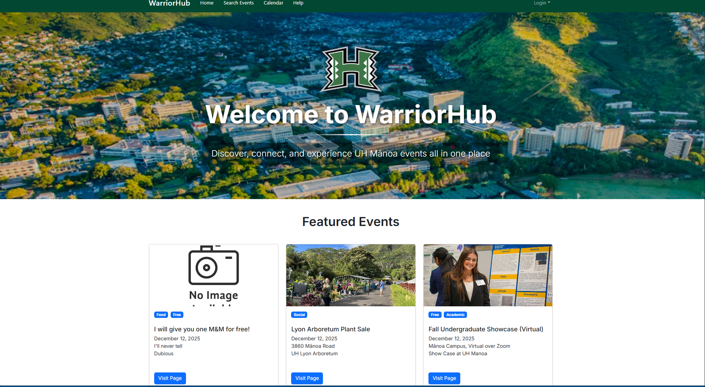
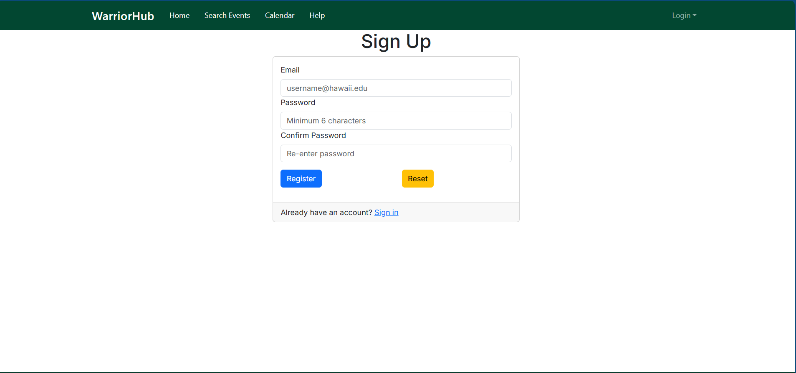
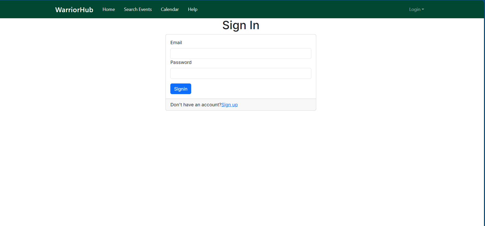
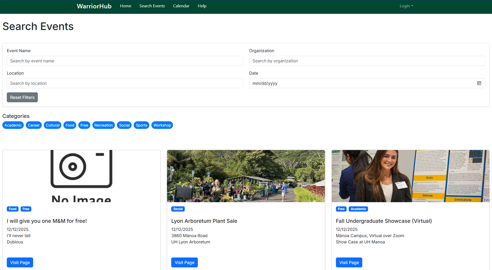
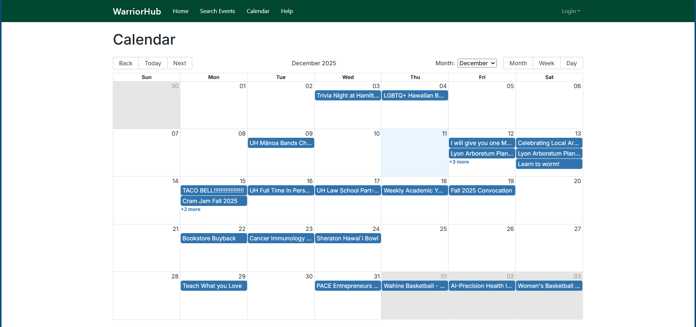
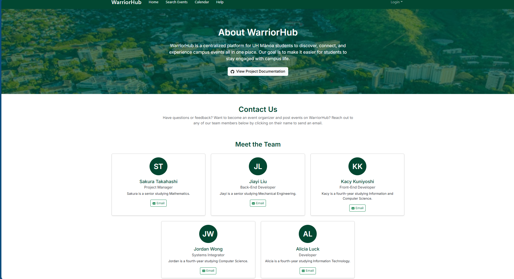
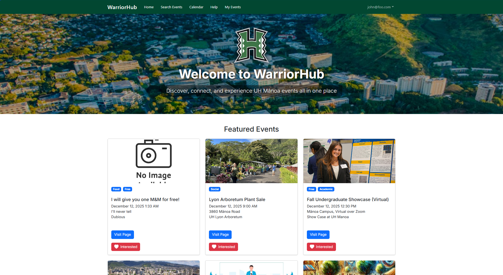
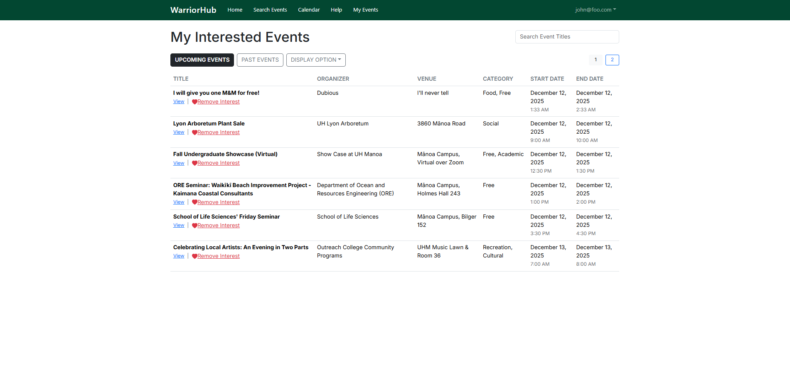
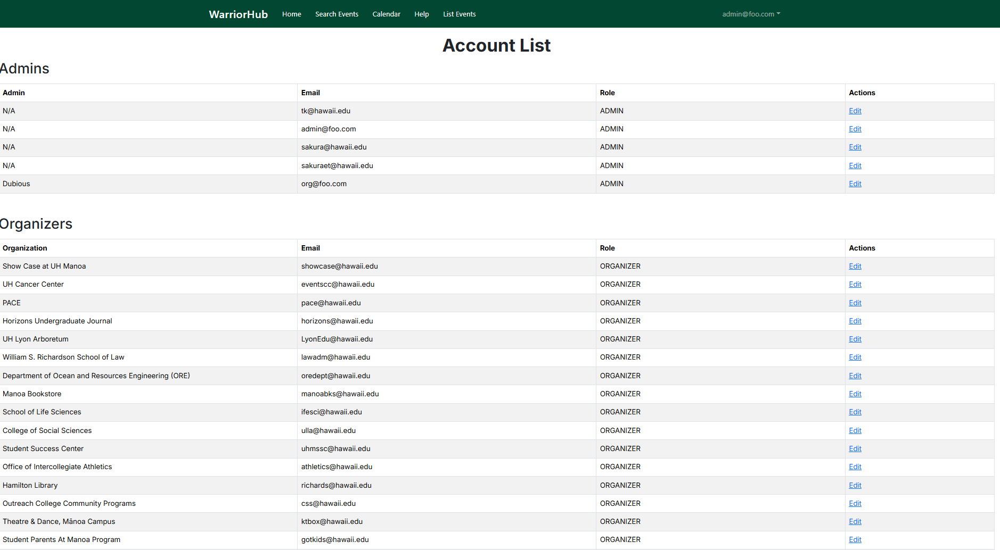

# WarriorHub: UH Mānoa Event Scheduler

[](https://github.com/warriorhub/warriorhub/actions/workflows/ci.yml)

## Table of contents

* [Overview](#overview)
* [Team](#team)
* [Our GitHub](#our-github)
* [Development](#development)
* [Deployment](#deployment)
* [Mockup Ideas](#mockup-ideas)
* [User Guide](#user-guide)
* [Developer Guide](#developer-guide)
* [Community Feedback](#community-feedback)
* [Example Enhancements](#example-enhancements)

## Overview


WarriorHub is a centralized event discovery platform designed specifically for students at the University of Hawai‘i at Mānoa. The platform provides a single location to explore on-campus activities, eliminating the need to navigate multiple calendars or department websites. Students can view upcoming opportunities, learn about organizations, and stay connected with student life throughout the semester.

Using WarriorHub, students can browse and filter events based on category, location, or personal preference. The web application will allow three types of users: students, organizers, and admins. 

* Students can browse events and set preferences
* Organizers can create and manage events
* Admins will validate new events, manage event quality, and organizer accounts

---

### The Problem


UH Mānoa has multiple independent event calendars, leading to missed opportunities and overlooked events due to the absence of filtering options. This makes finding relevant events difficult, reducing participation and visibility.

---

### The Solution

We will implement a mass event scheduler. This will allow various organizations to input their events on a singular website, allowing for efficiency and ease of use.  

---

## Team

WarriorHub is designed, implemented, and maintained by:

* Sakura Takahashi (<sakuraet@hawaii.edu>)
  * Sakura is a senior studying Mathematics, she is the Project Manager for WarriorHub.
* Jiayi Liu (<liujiayi@hawaii.edu>)
  * Jiayi is a senior studying Mechanical Engineering, she is the Back-End Developer for WarriorHub.
* Kacy Kuniyoshi (<kacykuni@hawaii.edu>)
  * Kacy is a fourth-year studying Information and Computer Science, she is the Front-End Developer for WarriorHub.
* Jordan Wong (<jordanww@hawaii.edu>)
  * Jordan is a fourth-year studying Computer Science, he is the Systems Integrator for WarriorHub.
* Alicia Luck (<luckmana@hawaii.edu>)
  * Alicia is a fourth-year studying Information Technology.
 
---

### Team Contract

Our team's Code of Conduct can be found in the [Team Contract](https://docs.google.com/document/d/1tgecXyrKeLgYMAdy3Xhf0NZaTgcaG1QSbqhRyxEmIIQ/edit?usp=sharing)

---

### Team Risk Management 

Our team's Risk Management Stategy can be found in [Risk Management](https://docs.google.com/document/d/1Jp-302tX5pGwH0ku5nrUV3UAuLDDxby6hVX-mHsiW0s/edit?usp=sharing)

---

### ER Diagrams 

Our team's ER Diagrams can be found in [ER Diagrams](https://docs.google.com/presentation/d/14YnM6afF5WKc4zZMfzPvoEVz50e-FAHdp16-gSI9WYE/edit?usp=sharing)

---

## Our GitHub

- View the WarriorHub organization [here](https://github.com/warriorhub)
- View the WarriorHub project repository [here](https://github.com/warriorhub/warriorhub)
- View the WarriorHub github.io page repository [here](https://github.com/warriorhub/warriorhub.github.io)

---

## Development

The development process for WarriorHub follows [Issue Driven Project Management](https://courses.ics.hawaii.edu/ics314f25/morea/project-management/reading-guidelines-idpm.html) practices: 

### Project Milestones

Here are our goals throughout this project, separated into Milestones. They can also be found on our organization's GitHub.

[Project Milestone 1](https://github.com/orgs/warriorhub/projects/1)

[Project Milestone 2](https://github.com/orgs/warriorhub/projects/2)

[Project Milestone 3](https://github.com/orgs/warriorhub/projects/5)

---

## Deployment

To make WarriorHub easily accessible to the UH Mānoa community, we’ve deployed our application using Vercel, a powerful platform for frontend frameworks and static sites. Vercel streamlines the deployment process, offering continuous integration with GitHub and automatic updates every time changes are pushed to the main branch.

You can access the deployed WarriorHub here: [https://warriorhub-gamma.vercel.app/](https://warriorhub-gamma.vercel.app/)

---

## Mockup Ideas 

This app will create an organized platform to present UH Mānoa–specific events in a unified student interface, with three role options.  

1. **Users:** Students log in with their UH email, set event and location preferences, and view customized recommendations.  
2. **Organizers:** Event planners can upload and manage events related to their department, hall, or organization.  
3. **Admins:** Oversee organizer accounts, manage events, and ensure quality control.  

---

### Use Cases

Our team's Use Cases can be found in [Use Cases](https://docs.google.com/presentation/d/1rMw5UsXPZhZZf5LEHpWYX6agsifNRFDt9q4ffFhPQIg/edit?usp=sharing)

---

### Test Cases

Our team's Test Cases can be found in [Test Cases](https://docs.google.com/document/d/19iKM6pti3KDqAr3zoeSKDaKKe0pFQD0zeyIBf0SXxpQ/edit?usp=sharing)

---

### Landing Page Mockup

Anyone visiting the site should have access to the landing page. Here the website displays some of its features to those who have not signed in yet. It should show the application name on the top left, navbar on the top, filters to search for events in the header, and carousels showing images of upcoming events.

<p align="center">
  
</p>
<p align="center">
  
</p>
<p align="center">
  
</p>

--- 

### Sign Up and Sign In Pages Mockup

If a new user is accessing the website, they have the option to register as a new user by clicking the “Login” button in the upper right corner of the page, clicking “Sign Up”, registering their email address, and deciding on a password.

<p align="center">
  
</p> 

If an existing user is accessing the website, they can sign in to the website by clicking the “Login” button in the upper right corner of the page, clicking “Sign In”, entering their email address, and inputting their password.

<p align="center">
  
</p>

--- 

### Search Events Page Mockup

Anyone visiting the site can also search through the events in the database through the search page. They have the option of searching by category or location, or by typing in search terms.

<p align="center">
  
</p> 
<p align="center">
  
</p>

--- 

### Event Details Page Mockup 

Anyone visting the site can click on the "View Details" button on event cards to be presented a detailed event details pop-up that provides additional information for the event like description, time, date, and etc. 

<p align="center">
  
</p>

--- 

### MyEvents Page Mockup

The MyEvents Page allows signed-in users to archive their interested events for future use by clicking "MyEvents" in the navbar. Here, users can see the event, status, organizer, location, category, recursion, and start and end dates. 

<p align="center">
  
</p>

---

### Help Page Mockup

Anyone using the application can view this page to see the members behind the creation of this application by clicking "Help". An overview of our goal and github.io main page is at the top and a collection of our information such as eduation and email are below.

Users can contact us through this page. Each of our names redirects to opening an email with our respective hawaii.edu email address. Users who are event organizers can contact us to request a higher level of permissions to create/edit/delete their events.

<p align="center">
  
</p>
<p align="center">
  
</p>
<p align="center">
  
</p>

---
### User Guide

This section provides a detailed walkthrough of the WarriorHub user interface, its pages, and its functionalities.

### Landing Page

The landing page is presented to everyone who visits the top-level URL of the website. It features a scenic aerial view of the UH Mānoa campus and introduces WarriorHub as a centralized platform for discovering and connecting with campus events. Visitors can browse featured events, view event details, and explore the calendar without signing in.  

<p align="center">
  
</p>

### Sign Up and Sign In Pages

If a new user is accessing the website, they can register by clicking the “Login” button in the upper right corner, selecting “Sign Up,” entering their UH email address, and creating a password.  

<p align="center">
  
</p>

If an existing user is accessing the website, they can sign in by clicking the “Login” button, selecting “Sign In,” and entering their email and password.  

<p align="center">
  
</p>

### Search Events Page

The “Search Events” page allows users to explore all upcoming events. Users can filter events by name, location, organization, and date. Category tags such as Academic, Career, Cultural, Food, Free, Recreation, Social, Sports, and Workshop help users narrow down results. Each event includes a thumbnail, tags, and a “Visit Page” button for more details.  

<p align="center">
  
</p>

### Calendar Page

The “Calendar” page displays all upcoming events in a monthly, weekly, or daily view. Users can navigate using “Back,” “Today,” and “Next” buttons. Events are color-coded and clickable, allowing users to preview event details directly from the calendar.  

<p align="center">
  
</p>

### Help Page

The “Help” page is accessible without signing in. It includes a brief description of WarriorHub’s mission and a “Contact Us” section. Users can reach out to team members via email and view the “Meet the Team” section, which lists each member’s role and academic background.  

<p align="center">
  
</p>

### User Homepage (After Login)

Once signed in, users are directed to their homepage. This page displays featured events tailored to their preferences. Each event includes a title, date, time, location, host organization, category tags, and buttons to mark interest or view more details.  

<p align="center">
  
</p>

### My Events Page (User View)

When signed in as a user, the My Events page displays all the events that the user has marked as “Interested.” This page provides a personalized view of upcoming activities that the user wants to track. Each event entry includes the title, organizer, venue, category tags, start and end date & time, and options to view more details or remove interest. This functionality helps users stay organized and easily revisit events they plan to attend.  

<p align="center">
  
</p>

### Organizer Homepage

When signed in as an organizer, the homepage displays a welcome message and access to profile settings. Organizers can view their registered email (which cannot be changed) and update their organization name. This name will be displayed publicly as the host for any events they create. The page also includes navigation links to other parts of the site such as Search Events, Calendar, Help, and My Events, allowing organizers to explore and manage campus activities efficiently.  

<p align="center">
  
</p>

### My Events Page (Organizer View)

When signed in as an organizer, the My Events page displays a list of all events created by the organizer. Each event entry includes the title, organizer name, venue, category tags, start and end date & time, and options to view, edit, or delete the event. The page also includes a search bar to help organizers quickly locate specific events by title, and an “Add New” button to create additional events. This layout allows organizers to efficiently manage their event listings and keep their calendar up to date.  

<p align="center">
  
</p>

### Add Event Page (Organizer View)

When signed in as an organizer, clicking the “Add New” button on the My Events page opens the Add Event form. Organizers can enter all relevant details for a new event, including the event name, date, time, location, description, and image URL. The form also includes category options such as Academic, Career, Cultural, Food, Free, Recreation, Social, Sports, and Workshop. Once completed, organizers can click the “Create Event” button to publish the event. This page streamlines the process of sharing campus activities with the UH Mānoa community.  

<p align="center">
  
</p>

### Edit Event Page (Organizer View)
When signed in as an organizer, clicking the “Edit” button on the My Events page opens the Edit Event form. Organizers can update event details including the name, description, location, date and time, image URL, and category tags. The form allows organizers to revise any part of the event listing and save changes instantly. This page helps organizers keep their event information accurate and up to date for the UH Mānoa community.  

<p align="center">
  
</p>

### List Events Page
The “Manage Events” page displays a table of all events with columns for title, organization, date & time, location, categories, and actions. Admins and organizers can edit or delete events directly from this interface. Categories are shown as tags, and each row includes buttons for quick management.  

<p align="center">
  
</p>

### Admin Homepage (Account List Page)

When signed in as an admin, the homepage is the Account List page. This page displays two tables: one for Admins and one for Organizers. Each entry includes the name, email, role, and an “Edit” action. Admins use this page to manage permissions, verify organizer accounts, and oversee the system’s user roles. By serving as the admin homepage, it provides a centralized interface for account management and ensures that event organizers are properly supervised.  

<p align="center">
  
</p>

### Change Password Page

If a user needs to update their account credentials, they can access the Change Password page. This page includes input fields for the old password, new password, and confirmation of the new password. Users can click the “Change” button to submit the update or use the “Reset” button to clear the form. This feature helps users maintain account security and manage their login information.  

<p align="center">
  
</p>
---

## Developer Guide

This guide provides an in-depth explanation on how to download, install, and run WarriorHub for new developers joining the project and contributors.

### Downloading The Project 

First clone the WarriorHub repository: [WarriorHub](https://github.com/warriorhub/warriorhub)

### Environment Setup 

Create a .env file in the project root and paste the environment variables from Vercel Postgres. Here's an example .env:

```

NEXTAUTH_SECRET=your-secret-here
NEXTAUTH_URL=http://localhost:3000

POSTGRES_DATABASE="verceldb"
POSTGRES_HOST="***"
POSTGRES_PASSWORD="***"
POSTGRES_USER="default"
POSTGRES_PRISMA_URL="postgres://..."
POSTGRES_URL_NON_POOLING="postgres://..."
POSTGRES_URL_NO_SSL="postgres://..."

DATABASE_URL="${POSTGRES_PRISMA_URL}"

```

### Installing Dependencies 

Change directories into your local copy of the repository, and run the following command to install third party libraries:

```
npm install
```

### Setup The Database 

Generate the Prisma client by running the following command:

```
npx prisma generate
```

Push the schema to the database by running the following command:

```
npx prisma db push
```

(Optional) Seed the database:

```
npx prisma db seed
```

### Running The Application 

Start the development server by running the following command:

```
npm run dev
```

Then access the app locally by putting [http://localhost:3000](http://localhost:3000) in a search browser. 

---

### (Optional) Testing 

Run Playwright tests using the following command:

```
npm run playwright-development
```

Run Jest using the following command:

```
npm test
```

---

## Community Feedback

TBD

---

## Example Enhancements

Additional planned features include:

* Notify students via email and SMS reminders of upcoming events, and notify them of similar events that are coming up that they might be interested in.
* Map viewing showing the location of nearby events.  
* System for reviews on events, allowing students to give anonymous feedback of the event after they have attended.
* Allow users to ‘like’ certain events that would give the program better suggestions on what kind of events a user would like to attend for personalized recommendations.
* Engagement points for people who attend events and reward badges for users to unlock. (i.e “Athletics Fan”, “Music Jammer”, “Foodie”, etc.)
