# WarriorHub: UH Mānoa Event Scheduler

## Table of contents

* [Overview](#overview)
* [Team](#team)
* [Our GitHub](#our-github)
* [Development](#development)
* [Deployment](#deployment)
* [Mockup Ideas](#mockup-ideas)
* [User Guide](#user-guide)
* [Developer Guide](#developer-guide)
* [Community Feedback](#community-feedback)
* [Example Enhancements](#example-enhancements)

## Overview

WarriorHub is a web application that will provide UH Mānoa students to browse on-campus events all in one place. With WarriorHub, students will no longer have to search across multiple websites and calenders to find events that interests them. Now students may experience the campus life to the fullest and stay informed about activities that they enjoy. Users will be able to browse, search, and filter events that are most relevant to them. The web application will allow three types of users: students, admins, and organizers.

* Students can browse and RSVP for events
* Organizers can create and manage events
* Admins will validate new events, manage event quality, and organizer accounts

---

### The Problem

Currently, UH Mānoa has several different event calendars with varying functionality, which are all disconnected from each other.  
For instance, Hamilton Library has its own calendar with events such as trivia night and board game night; however, these events are not advertised on the [UH Mānoa Events Calendar](https://www.hawaii.edu/calendar/manoa/2025/11/5).  

Moreover, events cannot be filtered by category, often leaving users with inefficient visualizations. This results in students having to check multiple sites to find relevant events, which leads to lower attendance.

---

### The Solution

We will implement a mass event scheduler. This will allow various organizations to input their events on a singular website, allowing for efficiency and ease of use.  

---

## Team

WarriorHub is designed, implemented, and maintained by:

* Sakura Takahashi (<sakuraet@hawaii.edu>)
  * Sakura is a senior studying Mathematics, she is the Project Manager for WarriorHub.
* Jiayi Liu (<liujiayi@hawaii.edu>)
  * Jiayi is a senior studying Mechanical Engineering, she is the Back-End Developer for WarriorHub.
* Kacy Kuniyoshi (<kacykuni@hawaii.edu>)
  * Kacy is a fourth-year studying Information and Computer Science, she is the Front-End Developer for WarriorHub.
* Jordan Wong (<jordanww@hawaii.edu>)
  * Jordan is a fourth-year studying Computer Science, he is the Systems Integrator for WarriorHub.
* Alicia Luck (<luckmana@hawaii.edu>)
  * Alicia is a fourth-year studying Information Technology.
 
---

### Team Contract

Our team's Code of Conduct can be found in the [Team Contract](https://docs.google.com/document/d/1tgecXyrKeLgYMAdy3Xhf0NZaTgcaG1QSbqhRyxEmIIQ/edit?usp=sharing)

---

### Team Risk Management 

Our team's Risk Management Stategy can be found in [Risk Management](https://docs.google.com/document/d/1Jp-302tX5pGwH0ku5nrUV3UAuLDDxby6hVX-mHsiW0s/edit?usp=sharing)

---

### ER Diagrams 

Our team's ER Diagrams can be found in [ER Diagrams](https://docs.google.com/presentation/d/14YnM6afF5WKc4zZMfzPvoEVz50e-FAHdp16-gSI9WYE/edit?usp=sharing)

---

## Our GitHub

- View the WarriorHub organization [here](https://github.com/warriorhub)
- View the WarriorHub project repository [here](https://github.com/warriorhub/warriorhub)
- View the WarriorHub github.io page repository [here](https://github.com/warriorhub/warriorhub.github.io)

---

## Development

The development process for WarriorHub follows [Issue Driven Project Management](https://courses.ics.hawaii.edu/ics314f25/morea/project-management/reading-guidelines-idpm.html) practices: 

### Project Milestones

Here are our goals throughout this project, separated into Milestones. They can also be found on our organization's GitHub.

[Project Milestone 1](https://github.com/orgs/warriorhub/projects/1)

[Project Milestone 2](https://github.com/orgs/warriorhub/projects/2)

[Project Milestone 3](https://github.com/orgs/warriorhub/projects/5)

---

## Deployment

To make WarriorHub easily accessible to the UH Mānoa community, we’ve deployed our application using Vercel, a powerful platform for frontend frameworks and static sites. Vercel streamlines the deployment process, offering continuous integration with GitHub and automatic updates every time changes are pushed to the main branch.

You can access the deployed WarriorHub here: [https://warriorhub-gamma.vercel.app/](https://warriorhub-gamma.vercel.app/)

---

## Mockup Ideas 

This app will create an organized platform to present UH Mānoa–specific events in a unified student interface, with three role options.  

1. **Users:** Students log in with their UH email, set event and location preferences, and view customized recommendations.  
2. **Organizers:** Event planners can upload and manage events related to their department, hall, or organization.  
3. **Admins:** Oversee organizer accounts, approve or edit events, and ensure quality control.  

---

### Use Cases

Our team's Use Cases can be found in [Use Cases](https://docs.google.com/presentation/d/1rMw5UsXPZhZZf5LEHpWYX6agsifNRFDt9q4ffFhPQIg/edit?usp=sharing)

---

### Test Cases

Our team's Test Cases can be found in [Test Cases](https://docs.google.com/document/d/19iKM6pti3KDqAr3zoeSKDaKKe0pFQD0zeyIBf0SXxpQ/edit?usp=sharing)

---

### Landing Page Mockup

Anyone visiting the site should have access to the landing page. Here the website displays some of its features to those who have not signed in yet. It should show the application name on the top right, navbar on the top, filters to search for events in the header, and carousels showing images of upcoming events.

<p align="center">
  
</p>
<p align="center">
  
</p>
<p align="center">
  
</p>

--- 

### Sign Up and Sign In Pages Mockup

If a new user is accessing the website, they have the option to register as a new user by clicking the “Login” button in the upper right corner of the page, clicking “Sign Up”, registering their email address, and deciding on a password.

<p align="center">
  
</p> 

If an existing user is accessing the website, they can sign in to the website by clicking the “Login” button in the upper right corner of the page, clicking “Sign In”, entering their email address, and inputting their password.

<p align="center">
  
</p>

--- 

### Search Events Page Mockup

Anyone visiting the site can also search through the events in the database through the search page. They have the option of searching by category or location, or by typing in search terms.

<p align="center">
  
</p> 
<p align="center">
  
</p>

--- 

### Event Details Page Mockup 

Anyone visting the site can click on the "View Details" button on event cards to be presented a detailed event details pop-up that provides additional information for the event like description, time, date, and etc. 

<p align="center">
  
</p>

--- 

### MyEvents Page Mockup

The MyEvents Page allows signed-in users to archive their interested events for future use by clicking "MyEvents" in the navbar. Here, users can see the event, status, organizer, location, category, recursion, and start and end dates. 

<p align="center">
  
</p>

---

### Help Page Mockup

Anyone using the application can view this page to see the members behind the creation of this application by clicking "Help". An overview of our goal and github.io main page is at the top and a collection of our information such as eduation and email are below.

Users can contact us through this page. Each of our names redirects to opening an email with our respective hawaii.edu email address. Users who are event organizers can contact us to request a higher level of permissions to create/edit/delete their events.

<p align="center">
  
</p>
<p align="center">
  
</p>
<p align="center">
  
</p>

---

## User Guide

This section provides a detailed walkthrough of the WarriorHub interface, its pages, and its functionalities. To access the varying functional features which are specific to each role type, use example accounts for their respective role type.

---

### Landing Page

Anyone visiting the site should have access to the landing page. Here the website displays some of its features to those who have not signed in yet. It should show the application name on the top right, navbar on the top, filters to search for events in the header, and carousels showing images of upcoming events.

<p align="center">
  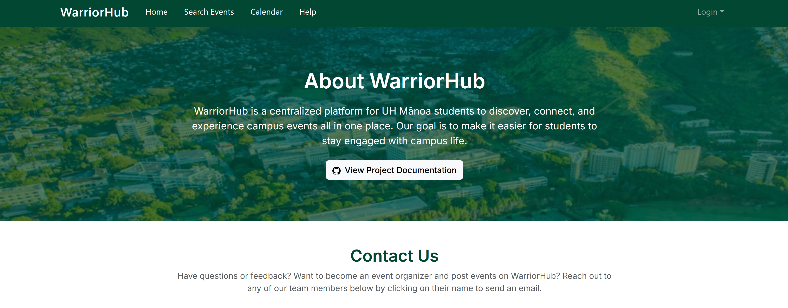
</p>
<p align="center">
  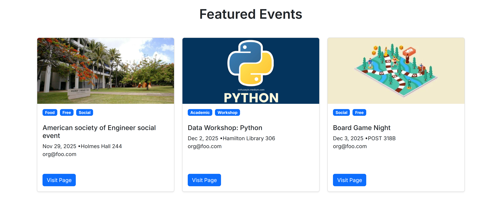
</p>
<p align="center">
  
</p>

--- 

### Sign Up and Sign In Page

If a new user is accessing the website, they have the option to register as a new user by clicking the “Login” button in the upper right corner of the page, clicking “Sign Up”, registering their @hawaii.edu email address, and deciding on a password.

<p align="center">
  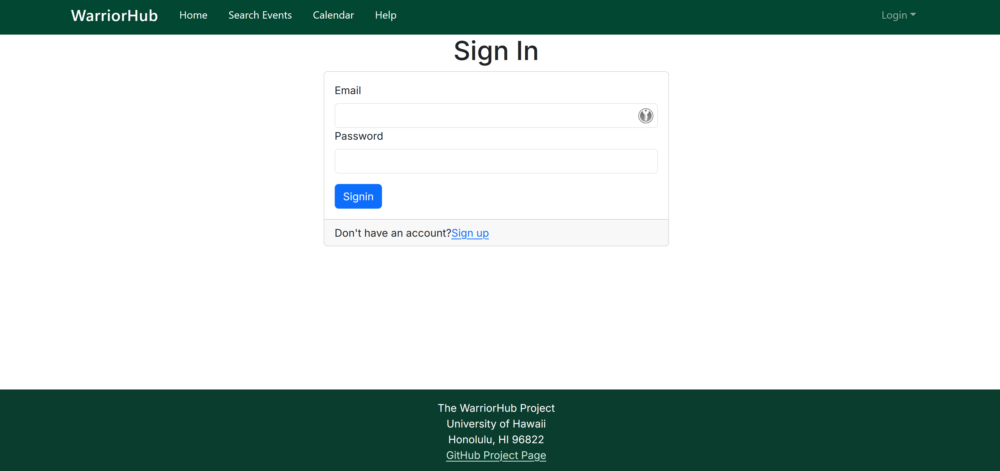
</p> 

If an existing user is accessing the website, they can sign in to the website by clicking the “Login” button in the upper right corner of the page, clicking “Sign In”, entering their email address, and inputting their password.

<p align="center">
  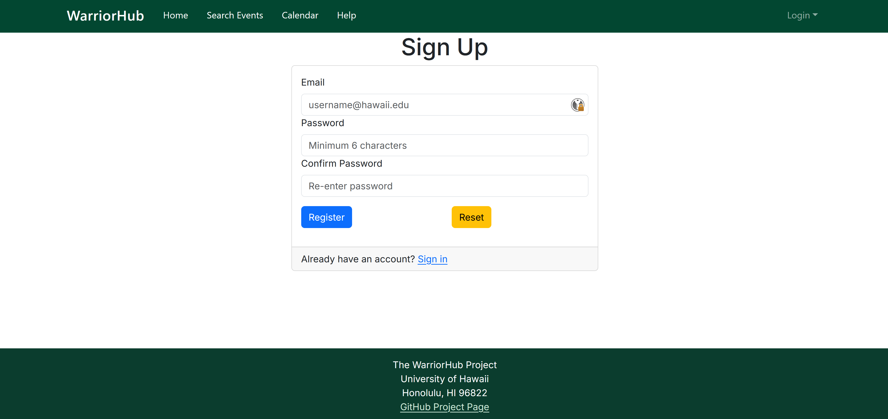
</p>

--- 

### Calendar Page

Anyone visiting the site should have access to the Calendar Page to visually track upcoming events.

<p align="center">
  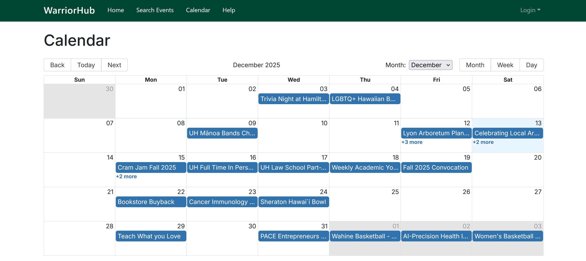
</p>

--- 

### Search Events Page

Anyone visiting the site can also search through the events in the database through the Search Events page. They have the option of searching by name, location, organization, or date.

<p align="center">
  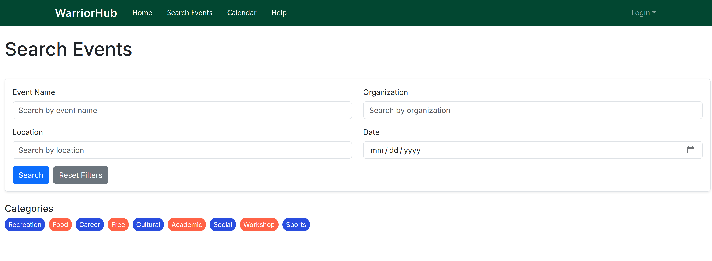
</p> 
<p align="center">
  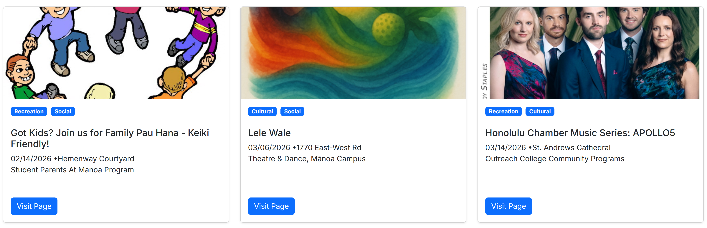
</p> 

--- 

### Event Details Page

Anyone visting the site can click on the "View Page" button on event cards to be presented a detailed event details pop-up that provides additional information for the event like description, time, date, location, organizer, etc. The "Interested" button only appears on the Event Details page if the signed-in account has the role type of user.

<p align="center">
  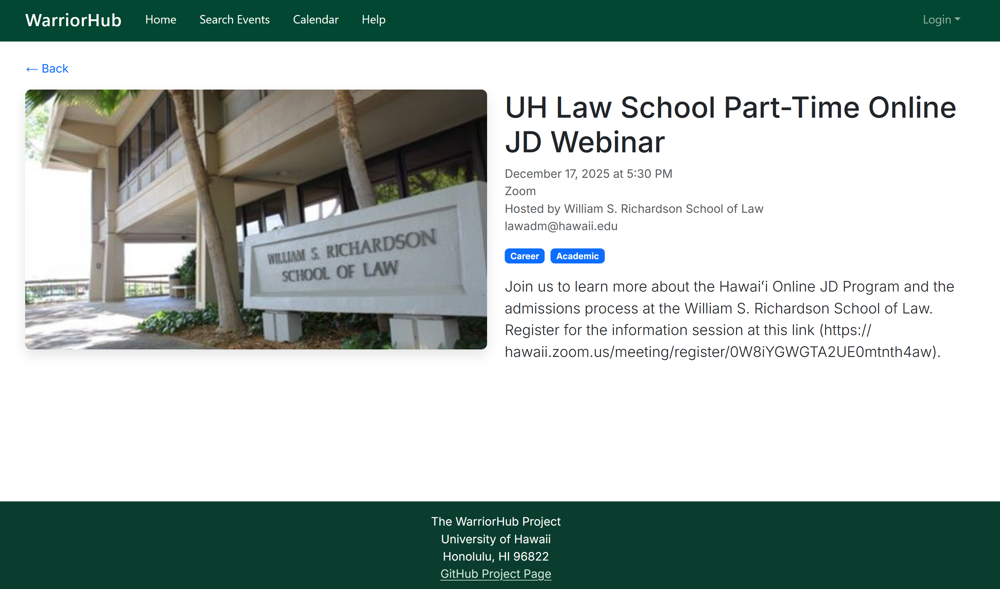
</p> 

--- 

### Home Page (User)

When a user signs up or logs in, they can click on the "Home" link in the navbar and be taken to a list of all events which they can now RSVP for. This includes upcoming events as well as past events, like the landing page. 

<p align="center">
  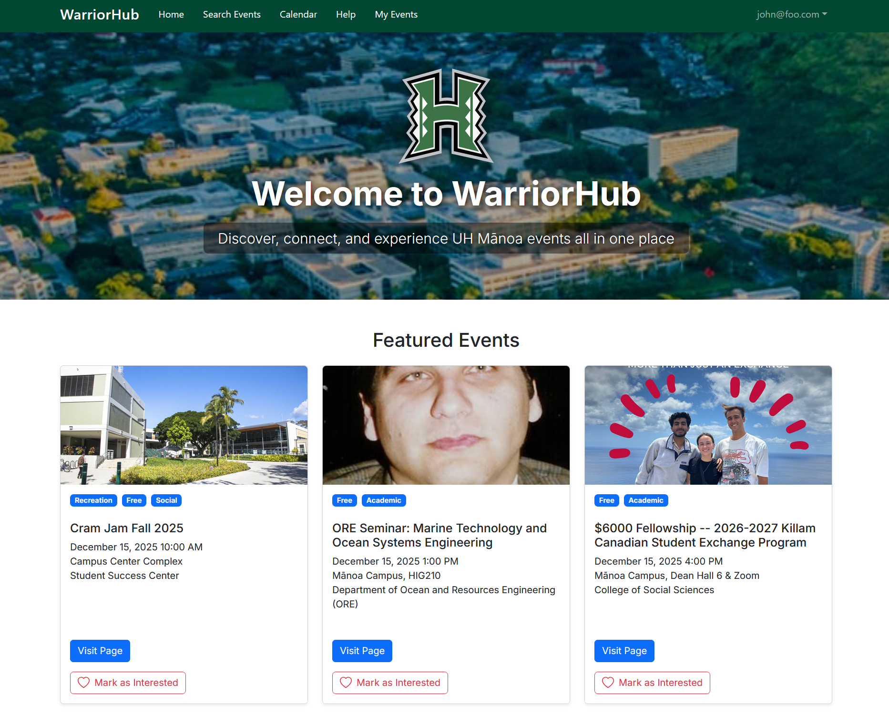
</p> 

### Home Page (Organizer)

When an organizer signs up or logs in, they can click on the “Home” link in the navbar and be taken to a list of all the features they have access to. This includes "Create Events" and "Manage Events" on the Organizer Dashboard. 

<p align="center">
  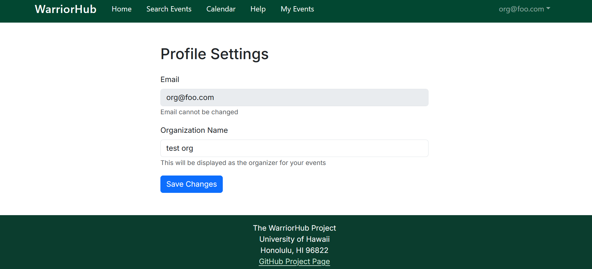
</p> 

### Home Page (Admin)

When an admin signs up or logs in, they can click on the “Home” link in the navbar and be taken to a list of all accounts in the database. Admins have access to editing the role types of all accounts to ensure that only verified organizations are granted the role of organizer by clicking "Edit".

<p align="center">
  
</p> 

#### Home Page Edit User (Admin) 

Below is the Admin Edit User Page where admins can change any account's role type. 

<p align="center">
  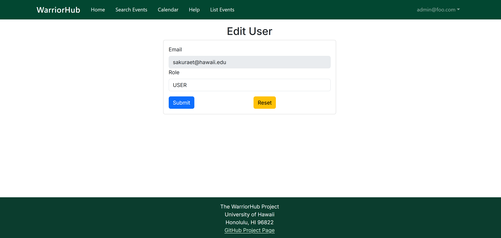
</p> 

---

### My Events Page (User)

The My Events Page allows signed-in users to archive their interested events by clicking "My Events" in the navbar. Here, users can see the event, status, organizer, venue, category, recursion, and start and end dates. They can also remove events from their My Interested Events by clicking "Remove Interest".

<p align="center">
  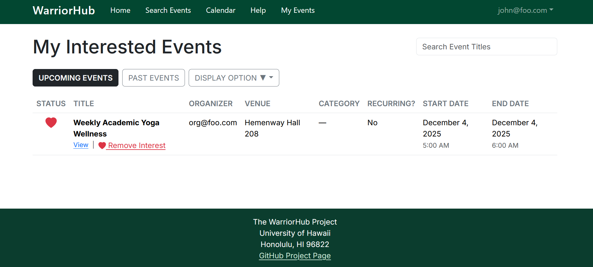
</p> 

#### My Events Page Past View (User)

Users can access their past interested events by clicking "Past".

<p align="center">
  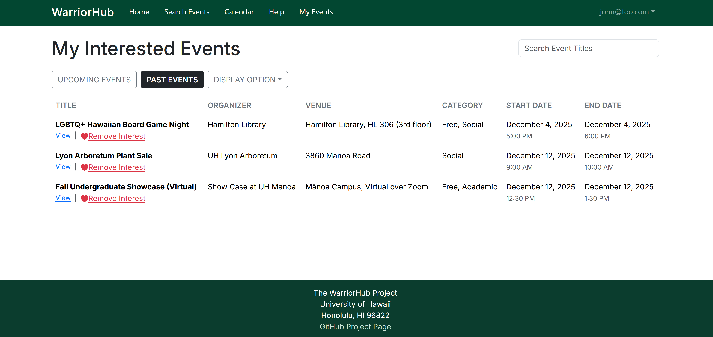
</p> 


#### My Events Card View (User)

Users can access their events in a card format as well as the table view shown previously by clicking "Display Option".

<p align="center">
  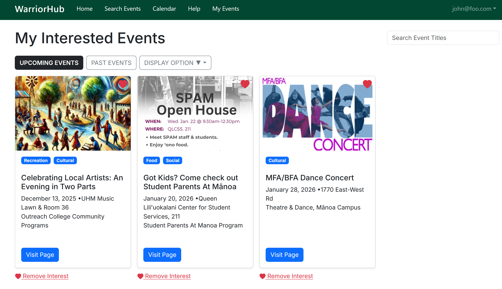
</p> 


### My Events Page (Organizer)

The My Events Page allows organizers to track their events by clicking "My Events" in the navbar. Here, organizers can see their event, status, organizer, location, category, recursion, and start and end dates. They can also view, edit, and delete thier events by clicking their repective links.
<p align="center">
  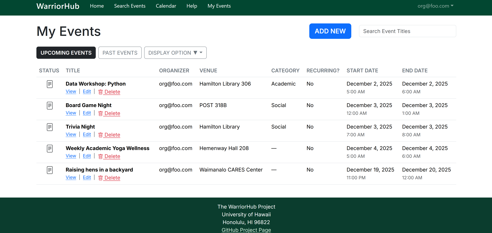
</p> 

#### My Events Page Past View (Organizer)

Organizers can access their past events by clicking "Past".

<p align="center">
  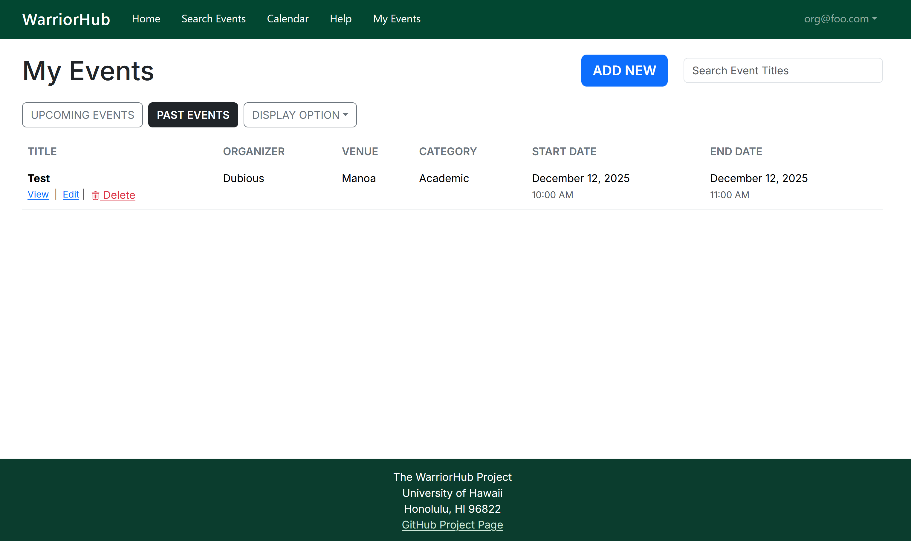
</p> 


#### My Events Card View (Organizer)

Organizers can access their events in a card format as well as the table view shown previously by clicking "Display Option".

<p align="center">
  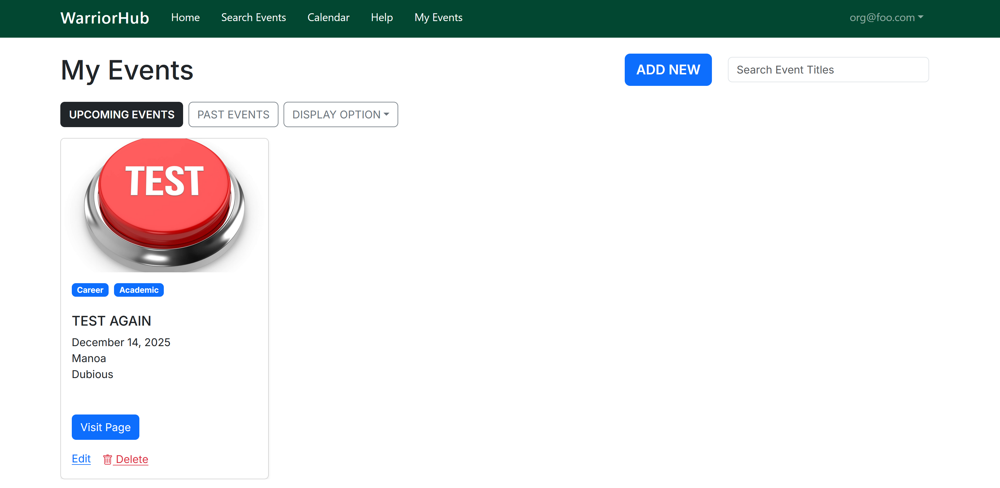
</p> 


### List Events Page (Admin)

The List Events Page allows admins to access a list of all events in the database. They can then have permission to add/delete/edit any event by clicking their repective links/buttons.

<p align="center">
  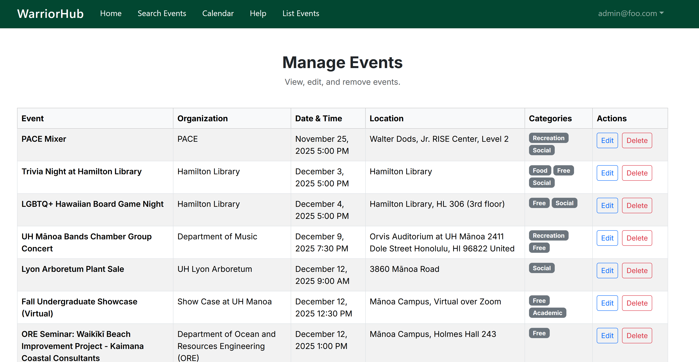
</p> 

---

### Help Page

Anyone using the application can view this page to see the members behind the creation of this application by clicking "Help". An overview of our goal and github.io main page is at the top and a collection of our information such as eduation and email are below.

Users can contact us through this page. Each of our names redirects to opening an email with our respective hawaii.edu email address. Users who are event organizers can contact us to request a higher level of permissions to create/edit/delete their events.

<p align="center">
  
</p>
<p align="center">
  
</p>
<p align="center">
  
</p>

---

### Add / Delete / Edit Event Page (Organizer)

Organizers can upload and manage (add/delete/edit) events related to their organization in their "My Events" page.

#### Edit Event Page (Organizer)

<p align="center">
  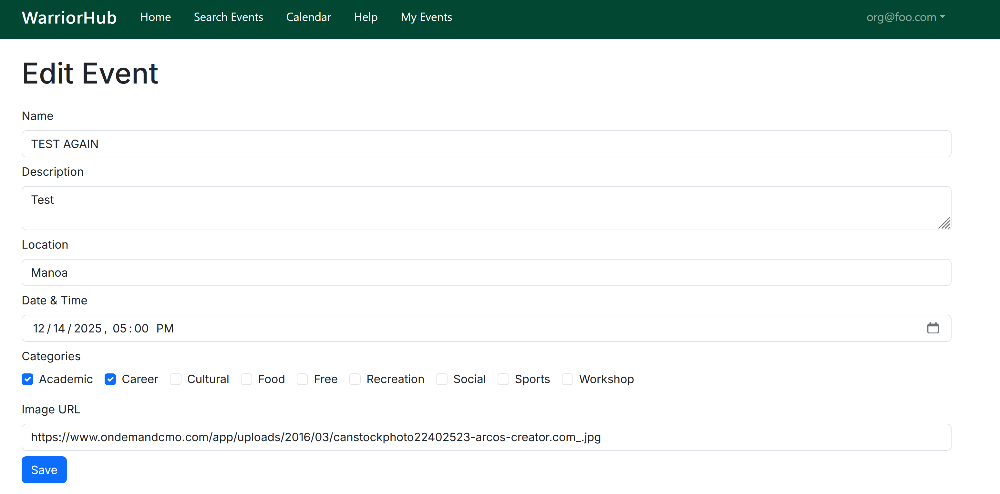
</p>

#### Add Event Page (Organizer)

<p align="center">
  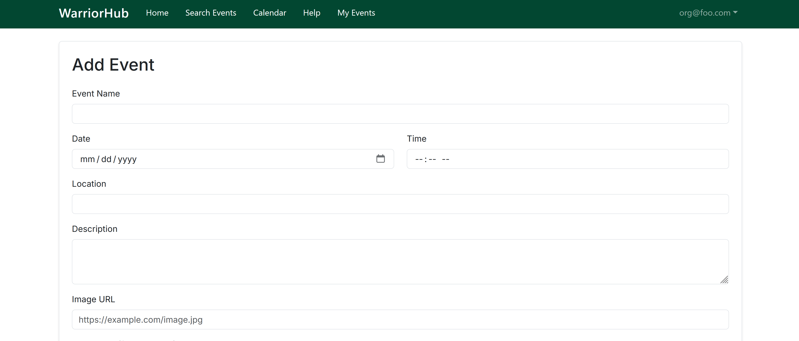
</p>
<p align="center">
  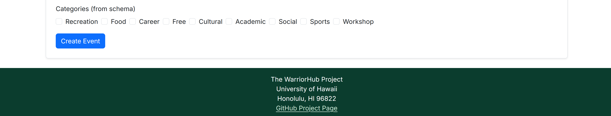
</p>

### Add / Delete / Edit Event Page (Admin)

Admins can upload and manage (add/delete/edit) any/all events in their List Events page to ensure quality control.  

<p align="center">
  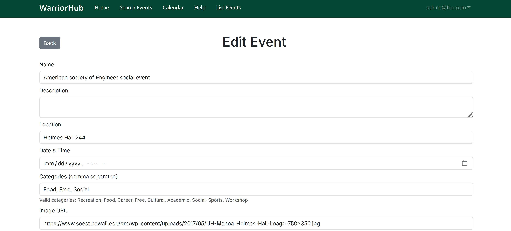
</p>
<p align="center">
  
</p>

---

## Developer Guide

This guide provides an in-depth explanation on how to download, install, and run WarriorHub for new developers joining the project and contributors.

### Downloading The Project 

First clone the WarriorHub repository: [WarriorHub](https://github.com/warriorhub/warriorhub)

### Environment Setup 

Create a .env file in the project root and paste the environment variables from Vercel Postgres. Here's an example .env:

```

NEXTAUTH_SECRET=your-secret-here
NEXTAUTH_URL=http://localhost:3000

POSTGRES_DATABASE="verceldb"
POSTGRES_HOST="***"
POSTGRES_PASSWORD="***"
POSTGRES_USER="default"
POSTGRES_PRISMA_URL="postgres://..."
POSTGRES_URL_NON_POOLING="postgres://..."
POSTGRES_URL_NO_SSL="postgres://..."

DATABASE_URL="${POSTGRES_PRISMA_URL}"

```

### Installing Dependencies 

Change directories into your local copy of the repository, and run the following command to install third party libraries:

```
npm install
```

### Setup The Database 

Generate the Prisma client by running the following command:

```
npx prisma generate
```

Push the schema to the database by running the following command:

```
npx prisma db push
```

(Optional) Seed the database:

```
npx prisma db seed
```

### Running The Application 

Start the development server by running the following command:

```
npm run dev
```

Then access the app locally by putting [http://localhost:3000](http://localhost:3000) in a search browser. 

---

### (Optional) Testing 

Run Playwright tests using the following command:

```
npm run playwright-development
```

Run Jest using the following command:

```
npm test
```

---

## Community Feedback

TBD

---

## Example Enhancements

Additional planned features include:

* Notify students via email and SMS reminders of upcoming events that they have RSVPed for and notifying similar events that are coming up that they might be interested in.
* Map viewing showing the location of nearby events.  
* System for reviews on events, allowing RSVP students to give anonymous feedback of the event after they have attended.
* Allow users to ‘like’ certain events that would give the program better suggestions on what kind of events a user would like to attend for personalized recommendations.
* Engagement points for people who attend events and reward badges for users to unlock. (i.e “Athletics Fan”, “Music Jammer”, “Foodie”, etc.)
