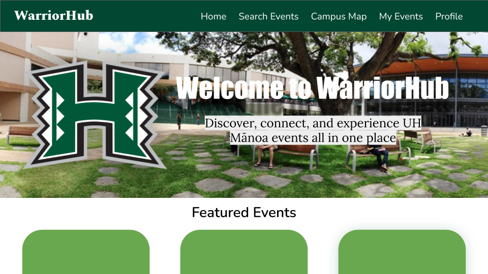

# WarriorHub: UH Mānoa Event Scheduler

## Table of contents

* [Overview](#overview)
* [Team](#team)
* [Our Github](#our-github)
* [Team Contract](#team-contract)
* [Deployment](#deployment)
* [User Guide](#user-guide)
* [Community Feedback](#community-feedback)
* [Developer Guide](#developer-guide)
* [Development History](#development-history)
* [Continuous Integration](#continuous-integration)
* [Walkthrough videos](#walkthrough-videos)
* [Example enhancements](#example-enhancements)

## Overview

WarriorHub is a web application that will provide UH Mānoa students to browse on-campus events all in one place. With WarriorHub, students will no longer have to search across multiple websites and calenders to find events that interests them. Now students may experience the campus life to the fullest and stay informed about activities that they enjoy. Users will be able to browse, search, and filter events that are most relevant to them. The web application will allow three types of users: students, admins, and organizers.

* Students can browse and RSVP for events
* Organizers can create and manage events
* Admins will validate new events, manage event quality, and organizer accounts

WarriorHub will illustrate a variety of technologies useful to ICS software engineering students that include and not limited to:

* React
* React Bootstrap
* Nextjs
* HTML and CSS

### The Problem

Currently, UH Mānoa has several different event calendars with varying functionality, which are all disconnected from each other.  
For instance, Hamilton Library has its own calendar with events such as trivia night and board game night; however, these events are not advertised on the [UH Mānoa Events Calendar](https://www.hawaii.edu/calendar/manoa/2025/11/5).  

Moreover, events cannot be filtered by category, often leaving users with inefficient visualizations. This results in students having to check multiple sites to find relevant events, which leads to lower attendance.

### The Solution

We will implement a mass event scheduler. This will allow various organizations to input their events on a singular website, allowing for efficiency and ease of use.  

## Team

WarriorHub is designed, implemented, and maintained by:

* Sakura Takahashi (<sakuraet@hawaii.edu>)
* Jiayi Lu
* Kacy Kuniyoshi
* Jordan Wong
* Alicia Luck

## Our GitHub

View our organization on GitHub [here](https://github.com/warriorhub)

## Team Contract

Our team's code of conduct can be found in the [Team Contract](https://docs.google.com/document/d/1tgecXyrKeLgYMAdy3Xhf0NZaTgcaG1QSbqhRyxEmIIQ/edit?usp=sharing)

## Deployment

Our running application is [here](https://github.com/warriorhub/warriorhub). It is currently not working.

## User Guide

### Approach

This app will create an organized platform to present UH Mānoa–specific events in a unified student interface, with three role options.  

The app will include three roles:

1. **Users:** Students log in with their UH email, set event and location preferences, and view customized recommendations.  
2. **Organizers:** Event planners can upload and manage events related to their department, hall, or organization.  
3. **Admins:** Oversee organizer accounts, approve or edit events, and ensure quality control.  

Organizers will manage all event details such as:

* Time
* Location
* Topic
* RSVP options

Users will be able to include their preferences, like their favorite event and their specific residence hall. This will allow the app to show more content relevant to them and give accurate recommendations.

---

### Use Cases

#### Users Searching for Events

1. User signs up with UH credentials.
2. Navigates to the Calendar page.
3. Selects interests and receives recommended events; irrelevant events are hidden.
4. Toggles filters (event type, size, location).
5. Views RSVP or interest indicators for signed-in users.
6. RSVPs to events and receives reminder notifications.

#### User Hosting an Event

1. User logs in with Organizer credentials.
2. Navigates to Create an Event page.
3. Fills in event details:
   * Date, time, and location
   * Category and summary
   * Flyers or website links
   * Sponsor and ticketing information
4. Optionally provides an external calendar link to import events.

#### Admin Editing the Page

1. Logs in with Admin credentials.
2. Visits the page with admin-only edit tools visible.
3. Documents and implements approved edits or changes.

---

### Landing Page Mockup

Anyone visiting the site should have access to the landing page. It should show the application name on the top right, navbar on the top, filters to search for events in the header, and two carousels showing images of upcoming events. The landing page is presented to users when they visit the top-level URL to the site.

  

---

### Event Search / Category Pages Mockup

Anyone visiting the site can also search through the events in the database through the search page. They have the option of searching by category or location location, or by typing in search terms.

---

### User Home Page Mockup

When a user signs up or logs in, they can click on the “MyEvents” link in the navbar and be taken to a list of events they have signed up for notifications for. This includes upcoming events as well as past events.

---

### Admin Home Page Mockup

When an admin signs up or logs in, they can click on the “MyEvents” link in the navbar and be taken to a list of all events.
They can then have permission to add/delete/edit the event via the [Add / Delete / Edit Event Page](#Add/Delete/Edit-Event-Page-Mockup).

---

### Organizer Home Page Mockup

When an organizer signs up or logs in, they can click on the “MyEvents” link in the navbar and be taken to a list of all events they have created.
They can then have permission to add/delete/edit their events via the [Add / Delete / Edit Event Page](#Add/Delete/Edit-Event-Page-Mockup).

---

### Add / Delete / Edit Event Page Mockup

TBD

---

### Calendar Page Mockup

TBD

---

### Event Detail Page Mockup

TBD

---

### Contact Us / About Us Page Mockup

Anyone using the application can view this page to see the members behind the creation of this application. An overview of our goal is at the top and a collection of our pictures are below.

Users can contact us through this page. Each of our names redirects to opening an email with our respective hawaii.edu email address. Users who are event organizers can contact us to request a higher level of permissions to create and post events.

---

### (Optional) Campus Map Page Mockup

TBD

---

### (Optional) User / Admin / Organizer Profile Page Mockup

TBD

---

## Community Feedback

TBD

## Developer Guide

TBD

### Installations

TBD

## Development History

N/A

## Continuous Integration

TBD

## Walkthrough Videos

TBD

## Example Enhancements

### Beyond the Basics

Additional planned features include:

* Notify students via email and SMS reminders of upcoming events that they have RSVPed for and notifying similar events that are coming up that they might be interested in..
* Map viewing showing the location of nearby events.  
* System for reviews on events, allowing RSVP students to give anonymous feedback of the event after they have attended.
* Allow users to ‘like’ certain events that would give the program better suggestions on what kind of events a user would like to attend for personalized reccomendations.
* Engagement points for people who attend events and reward badges for users to unlock. (i.e “Athletics Fan”, “Music Jammer”, “Foodie”, etc.)
