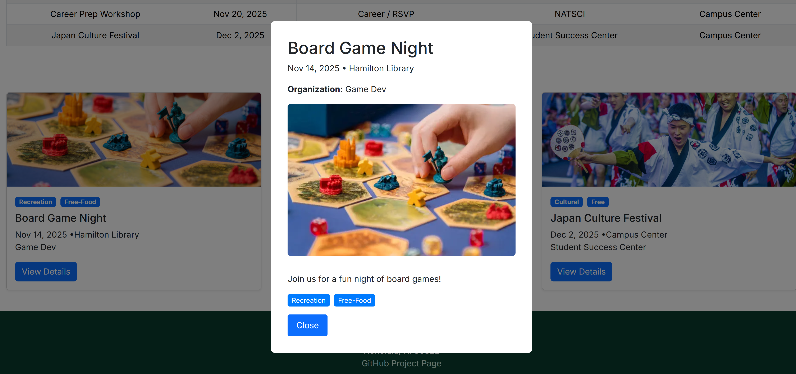
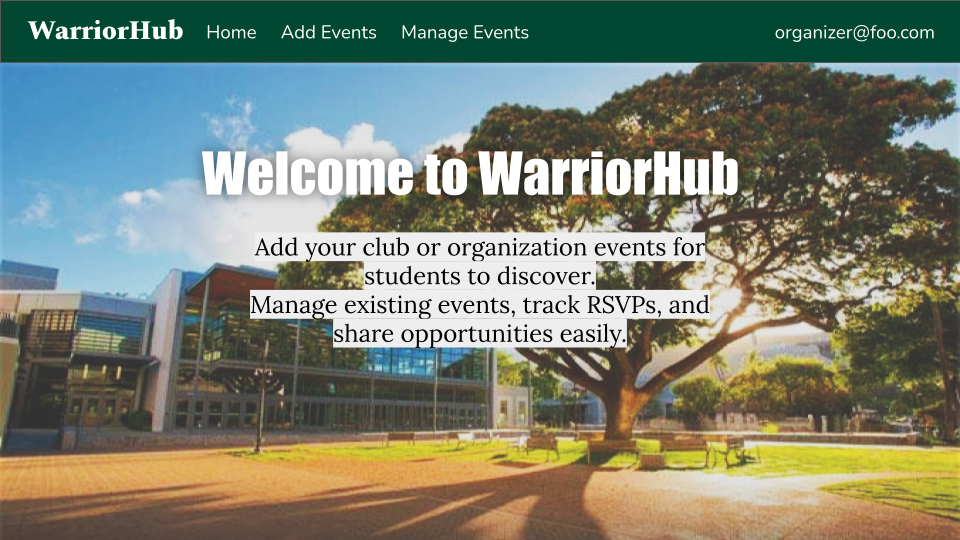
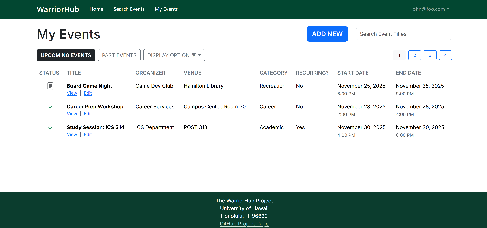
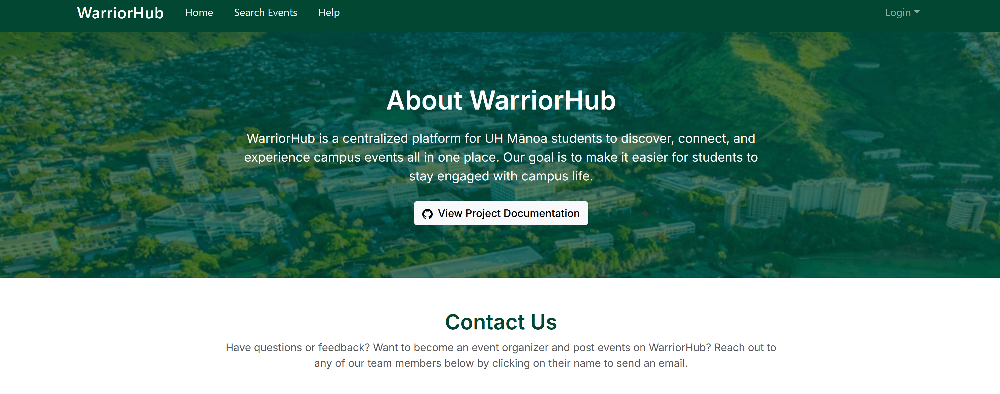
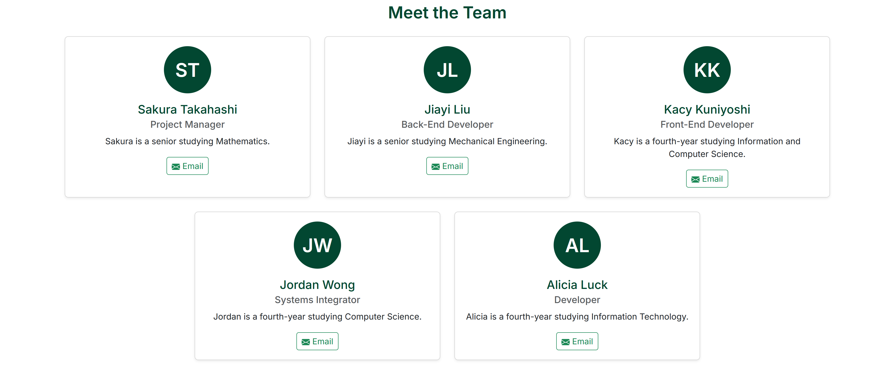

# WarriorHub: UH Mānoa Event Scheduler

## Table of contents

* [Overview](#overview)
* [Team](#team)
* [Our GitHub](#our-github)
* [Development](#development)
* [Deployment](#deployment)
* [Mockup Ideas](#mockup-ideas)
* [User Guide](#user-guide)
* [Developer Guide](#developer-guide)
* [Community Feedback](#community-feedback)
* [Example Enhancements](#example-enhancements)

## Overview

WarriorHub is a web application that will provide UH Mānoa students to browse on-campus events all in one place. With WarriorHub, students will no longer have to search across multiple websites and calenders to find events that interests them. Now students may experience the campus life to the fullest and stay informed about activities that they enjoy. Users will be able to browse, search, and filter events that are most relevant to them. The web application will allow three types of users: students, admins, and organizers.

* Students can browse and RSVP for events
* Organizers can create and manage events
* Admins will validate new events, manage event quality, and organizer accounts

---

### The Problem

Currently, UH Mānoa has several different event calendars with varying functionality, which are all disconnected from each other.  
For instance, Hamilton Library has its own calendar with events such as trivia night and board game night; however, these events are not advertised on the [UH Mānoa Events Calendar](https://www.hawaii.edu/calendar/manoa/2025/11/5).  

Moreover, events cannot be filtered by category, often leaving users with inefficient visualizations. This results in students having to check multiple sites to find relevant events, which leads to lower attendance.

---

### The Solution

We will implement a mass event scheduler. This will allow various organizations to input their events on a singular website, allowing for efficiency and ease of use.  

---

## Team

WarriorHub is designed, implemented, and maintained by:

* Sakura Takahashi (<sakuraet@hawaii.edu>)
  * Sakura is a senior studying Mathematics, she is the Project Manager for WarriorHub.
* Jiayi Liu (<liujiayi@hawaii.edu>)
  * Jiayi is a senior studying Mechanical Engineering, she is the Back-End Developer for WarriorHub.
* Kacy Kuniyoshi (<kacykuni@hawaii.edu>)
  * Kacy is a fourth-year studying Information and Computer Science, she is the Front-End Developer for WarriorHub.
* Jordan Wong (<jordanww@hawaii.edu>)
  * Jordan is a fourth-year studying Computer Science, he is the Systems Integrator for WarriorHub.
* Alicia Luck (<luckmana@hawaii.edu>)
  * Alicia is a fourth-year studying Information Technology.
 
---

### Team Contract

Our team's Code of Conduct can be found in the [Team Contract](https://docs.google.com/document/d/1tgecXyrKeLgYMAdy3Xhf0NZaTgcaG1QSbqhRyxEmIIQ/edit?usp=sharing)

---

### Team Risk Management 

Our team's Risk Management Stategy can be found in [Risk Management](https://docs.google.com/document/d/1Jp-302tX5pGwH0ku5nrUV3UAuLDDxby6hVX-mHsiW0s/edit?usp=sharing)

---

## Our GitHub

- View the WarriorHub organization [here](https://github.com/warriorhub)
- View the WarriorHub project repository [here](https://github.com/warriorhub/warriorhub)
- View the WarriorHub github.io page repository [here](https://github.com/warriorhub/warriorhub.github.io)

---

## Development

The development process for WarriorHub follows [Issue Driven Project Management](https://courses.ics.hawaii.edu/ics314f25/morea/project-management/reading-guidelines-idpm.html) practices: 

### Project Milestones

Here are our goals throughout this project, separated into Milestones. They can also be found on our organization's GitHub.

[Project Milestone 1](https://github.com/orgs/warriorhub/projects/1)

[Project Milestone 2](https://github.com/orgs/warriorhub/projects/2)

Project Milestone 3: TBD

---

## Deployment

### Vercel 

To make WarriorHub easily accessible to the UH Mānoa community, we’ve deployed our application using Vercel, a powerful platform for frontend frameworks and static sites. Vercel streamlines the deployment process, offering continuous integration with GitHub and automatic updates every time changes are pushed to the main branch.

You can access the deployed WarriorHub here: [https://warriorhub-gamma.vercel.app/](https://warriorhub-gamma.vercel.app/)

---

## Mockup Ideas 

This app will create an organized platform to present UH Mānoa–specific events in a unified student interface, with three role options.  

The app will include three roles:

1. **Users:** Students log in with their UH email, set event and location preferences, and view customized recommendations.  
2. **Organizers:** Event planners can upload and manage events related to their department, hall, or organization.  
3. **Admins:** Oversee organizer accounts, approve or edit events, and ensure quality control.  

Organizers will manage all event details such as:

* Time
* Location
* Topic
* RSVP options

Users will be able to include their preferences, like their favorite event and their specific residence hall. This will allow the app to show more content relevant to them and give accurate recommendations.

---

### Use Cases

Our team's Use Cases can be found in [Use Cases](https://docs.google.com/presentation/d/1rMw5UsXPZhZZf5LEHpWYX6agsifNRFDt9q4ffFhPQIg/edit?usp=sharing)

---

### Landing Page Mockup

Anyone visiting the site should have access to the landing page. Here the website displays some of its features to those who have not signed in yet. It should show the application name on the top right, navbar on the top, filters to search for events in the header, and carousels showing images of upcoming events.

  

  

  

--- 

### Sign Up and Sign In Pages Mockup

If a new user is accessing the website, they have the option to register as a new user by clicking the “Login” button in the upper right corner of the page, clicking “Sign Up”, registering their email address, and deciding on a password.

  

 

If an existing user is accessing the website, they can sign in to the website by clicking the “Login” button in the upper right corner of the page, clicking “Sign In”, entering their email address, and inputting their password.

  

--- 

### Search Events Page Mockup

Anyone visiting the site can also search through the events in the database through the search page. They have the option of searching by category or location, or by typing in search terms.

  

 

  

--- 

### Event Details Page Mockup 

Anyone visting the site can click on the "View Details" button on event cards to be presented a detailed event details pop-up that provides additional information for the event like description, time, date, and etc. 

  

--- 

### User Home Page Mockup

When a user signs up or logs in, they can click on the "Home" link in the navbar and be taken to a list of all events which they can now RSVP for. This includes upcoming events as well as past events, like the landing page. 

---

### Admin Home Page Mockup

When an admin signs up or logs in, they can click on the “Home” link in the navbar and be taken to a list of all events, like the landing page.
They can then have permission to add/delete/edit the event via the [Add / Delete / Edit Event Page](#Add/Delete/Edit-Event-Page-Mockup).

---

### Organizer Home Page Mockup

When an organizer signs up or logs in, they can click on the “Home” link in the navbar and be taken to a list of all events they have created.
They can then have permission to add/delete/edit their events via the [Add / Delete / Edit Event Page](#Add/Delete/Edit-Event-Page-Mockup).

  

 

---

### MyEvents Page Mockup

The MyEvents Page allows signed-in users to archive their interested events for future use by clicking "MyEvents" in the navbar. Here, users can see the event, status, organizer, location, category, recursion, and start and end dates. 

  

---

### Help Page Mockup

Anyone using the application can view this page to see the members behind the creation of this application by clicking "Help". An overview of our goal and github.io main page is at the top and a collection of our information such as eduation and email are below.

Users can contact us through this page. Each of our names redirects to opening an email with our respective hawaii.edu email address. Users who are event organizers can contact us to request a higher level of permissions to create/edit/delete their events.

  

  

  

---

### Add / Delete / Edit Event Page Mockup

Once you are logged in, you can define new projects with the Edit Project page:

1. **Users:** Can add/delete/edit their own archived events in their "My Events" page.
2. **Organizers:** Can upload and manage events related to their organization in their "My Events" page.
3. **Admins:** Can add/delete/edit any/all events in their "My Events" page to ensure quality control.  

---

### Calendar Page Mockup

Features of the Calendar Page

* Calendar showing a month at a time
* Events for that month
* Ability to view events on specific days

---

### (Optional) Campus Map Page Mockup

TBD

---

### (Optional) User / Admin / Organizer Profile Page Mockup

Features of the Profile Page

* View user profile
* Edit user profile

---

## User Guide

This section provides a detailed walkthrough of the WarriorHub user interface, its pages, and its functionalities.

---

## Developer Guide

TBD

---

### Installations

TBD

---

## Community Feedback

TBD

---

## Example Enhancements

Additional planned features include:

* Notify students via email and SMS reminders of upcoming events that they have RSVPed for and notifying similar events that are coming up that they might be interested in.
* Map viewing showing the location of nearby events.  
* System for reviews on events, allowing RSVP students to give anonymous feedback of the event after they have attended.
* Allow users to ‘like’ certain events that would give the program better suggestions on what kind of events a user would like to attend for personalized recommendations.
* Engagement points for people who attend events and reward badges for users to unlock. (i.e “Athletics Fan”, “Music Jammer”, “Foodie”, etc.)
